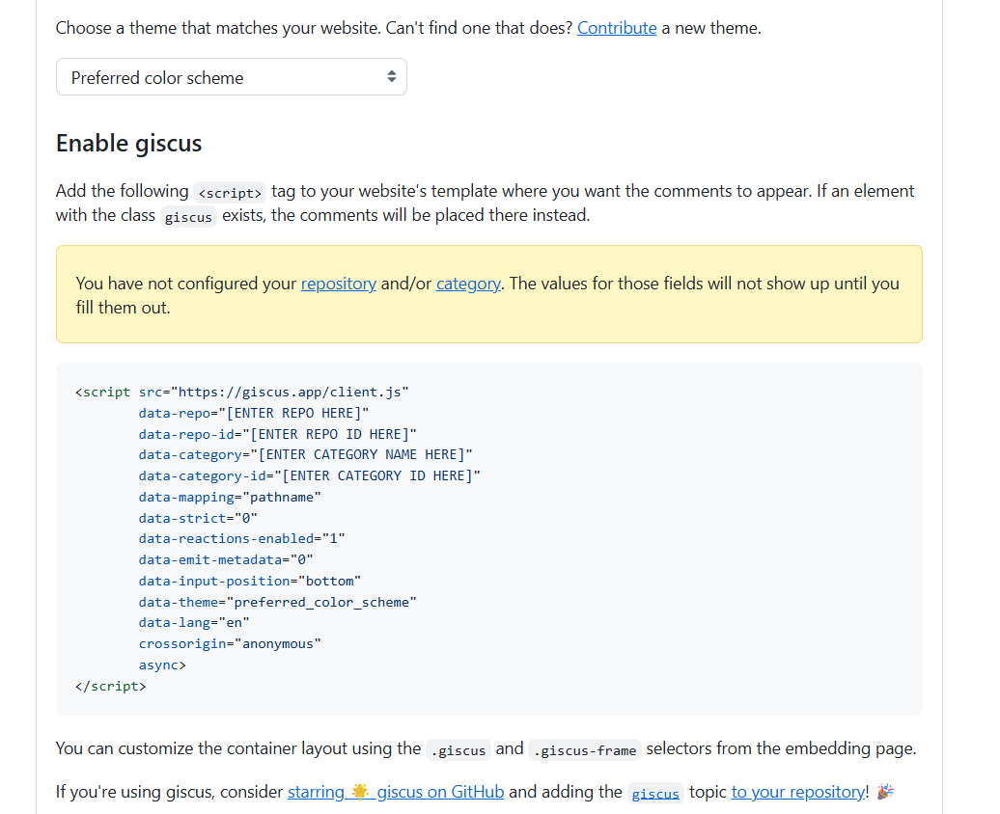

# Add Giscus to book 

According the the [Giscus page](https://giscus.app/):
> A comments system powered by GitHub Discussions. Let visitors leave comments and reactions on your website via GitHub! Heavily inspired by utterances.

## Setting up

We have to do 2 things, change the gh-action and add the giscus tag to our site. 

### Giscus tag

Follow the configurations on the website. This will generate a `<script>` tag which we will need. 



Next, we want to 

### Github action

As Jupyter Book does not support custom js yet, we will have to adjust the gh-action to append our giscus tag to each webpage. By adding the following code to the deploy file, the gh-action will look for a static folder and append all js files found to our site. 

:::yaml
- name: Insert static files
    run: |
        set -e

        HTML_DIR="_build/html"
        STATIC_SRC="static"
        STATIC_DEST="$HTML_DIR/static"

        echo "Searching for JS files in $STATIC_SRC..."
        js_files=$(find "$STATIC_SRC" -type f -name "*.js" | sort)
        js_count=$(echo "$js_files" | grep -c '.js' || true)

        if [ "$js_count" -eq 0 ]; then
        echo "⚠️ No JS files found in $STATIC_SRC"
        exit 0
        fi

        echo "Found $js_count JS file(s)."
        echo "Copying JS files to $STATIC_DEST ..."
        mkdir -p "$STATIC_DEST"
        for js_file in $js_files; do
        cp --parents "$js_file" "$HTML_DIR"/
        echo "📁 Copied: $js_file → $HTML_DIR/$js_file"
        done
        echo "✅ Copy complete."

        echo ""
        echo "Building absolute script tag block..."
        script_tags=""
        for js_file in $js_files; do
        filename=$(basename "$js_file")
        script_tags="${script_tags}\n<script src=\"${BASE_URL}/static/${filename}\"></script>"
        done

        echo ""
        echo "Searching for HTML files under $HTML_DIR..."
        html_files=$(find "$HTML_DIR" -type f -name "*.html" | sort)
        html_count=$(echo "$html_files" | grep -c '.html' || true)

        if [ "$html_count" -eq 0 ]; then
        echo "⚠️ No HTML files found in $HTML_DIR"
        exit 1
        fi

        echo "Found $html_count HTML file(s) to update:"
        echo "Inserting <script> tags before </head> in each HTML file..."
        echo "-------------------------------------------------------------"

        for file in $html_files; do
        echo " Updating: $file"
        sed -i "s|</head>|${script_tags}\n</head>|g" "$file"
        done

        echo ""
        echo "✅ Injection complete."
        echo "📊 Summary:"
        echo "  - JS files processed: $js_count"
        echo "  - HTML files updated: $html_count"
        echo "-------------------------------------------------------------"
:::

We can now write a js script to append our specific giscus tag, like in this example:

```javascript
(function () {
  function insertGiscus() {
    // avoid duplicates
    if (document.getElementById("giscus_container")) return;
    

    const container = document.createElement("div");
    container.id = "giscus_container";

    // place it inside main.content or fallback to body set target by classnames: article-grid subgrid-gap col-screen article content
    let target = document.getElementsByClassName("article-grid subgrid-gap col-screen article content")[0];
    
    target.appendChild(container);

    const script = document.createElement("script");
    script.src = "https://giscus.app/client.js";
    script.setAttribute("data-repo", "TUD-JB-Templates/JB2_plugins");
    script.setAttribute("data-repo-id", "R_kgDOPrPv2Q");
    script.setAttribute("data-category", "Page comments");
    script.setAttribute("data-category-id", "DIC_kwDOPrPv2c4CxX_-");
    script.setAttribute("data-mapping", "pathname");
    script.setAttribute("data-strict", "0");
    script.setAttribute("data-reactions-enabled", "1");
    script.setAttribute("data-emit-metadata", "0");
    script.setAttribute("data-input-position", "top");
    script.setAttribute("data-theme", "preferred_color_scheme");
    script.setAttribute("data-lang", "en");
    script.crossOrigin = "anonymous";
    script.async = true;

    container.appendChild(script);
    console.log("💬 Giscus injected.");
  }

  // Run once at first load with 2 second delay to ensure DOM is ready
  document.addEventListener("DOMContentLoaded", () => {
    setTimeout(insertGiscus, 2000);
  });

})();
```

This will wait for 2 seconds for the page to load, before appending the comment section to the bottom of the page.

:::{warning}

Make sure to change all atributes to correspond the generated tag

:::
